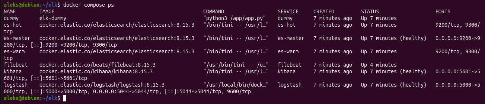
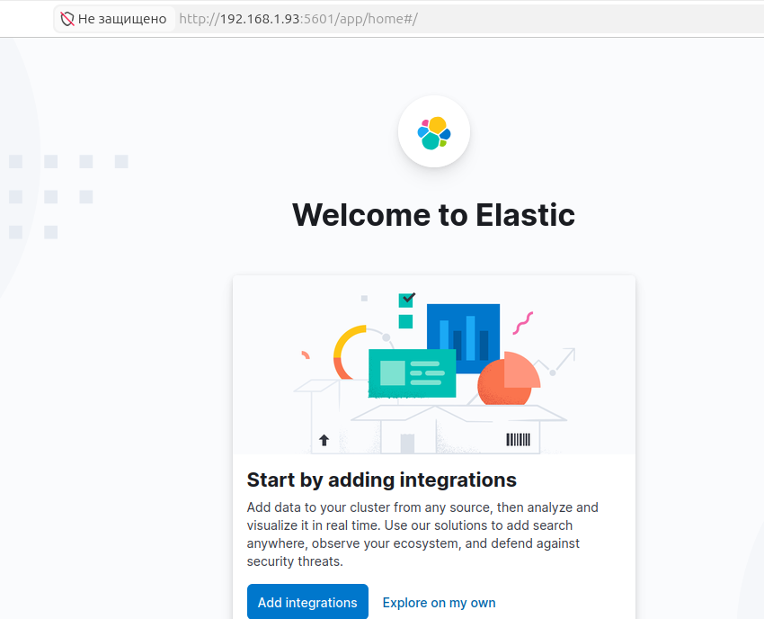
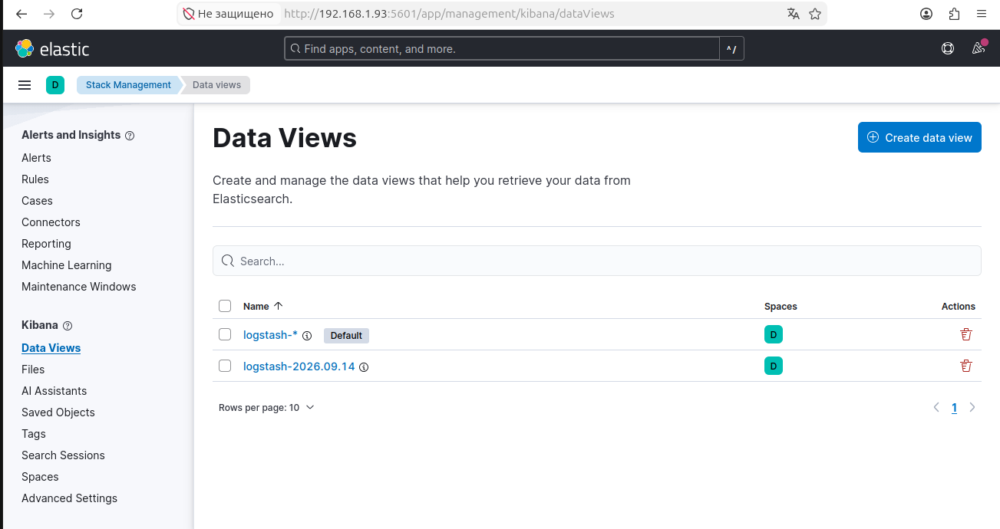
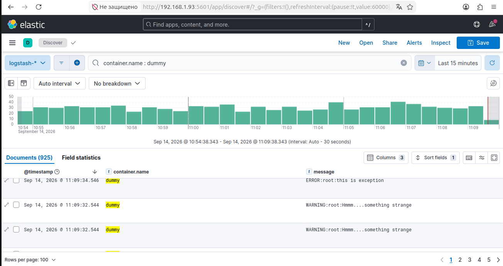

# Домашнее задание к занятию 15 «Система сбора логов Elastic Stack»

## Задание 1

Вам необходимо поднять в докере и связать между собой:

 - elasticsearch (hot и warm ноды);
 - logstash;
 - kibana;
 - filebeat.

 Logstash следует сконфигурировать для приёма по tcp json-сообщений.

 Filebeat следует сконфигурировать для отправки логов docker вашей системы в logstash.

 Результатом выполнения задания должны быть:
  - скриншот docker ps через 5 минут после старта всех контейнеров (их должно быть 5);
  - скриншот интерфейса kibana;
  - docker-compose манифест (если вы не использовали директорию help);
  - ваши yml-конфигурации для стека (если вы не использовали директорию help).

**Решение 1**

Приложение-генератор (dummy-app) поднят в docker.

Filebeat - Читает файлы логов всех Docker-контейнеров прямо с диска хоста (/var/lib/docker/containers/).

Logstash - Принимает логи от Filebeat (порт 5044) и прямые JSON-сообщения по TCP (порт 5000).

Elasticsearch (кластер из 3 узлов):
 - es-master — управляющий узел, координирует кластер;
 - es-hot — узел для свежих логов
 - es-warm — узел для старых логов

Kibana — веб-интерфейс (порт 5601)

dummy-app -> docker logs -> Filebeat -> Logstash -> Elasticsearch <- Kibana

[docker-compose.yml](config/docker-compose.yml)

[filebeat.yml](config/filebeat.yml)

[logstash.conf](config/logstash.conf)

## Задание 2

Перейдите в меню создания index-patterns в kibana и создайте несколько index-patterns из имеющихся.
Перейдите в меню просмотра логов в kibana (Discover) и самостоятельно изучите, как отображаются логи и как производить поиск по логам.

**Решение 2**

